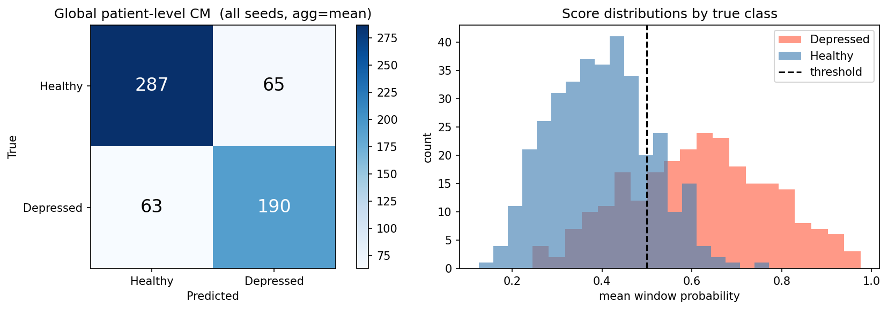
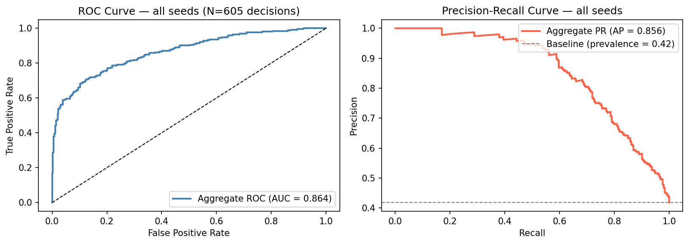
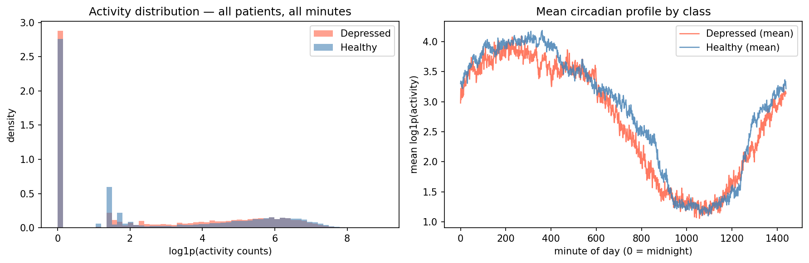

# ActiPheno

Binary depression classification from wrist actigraphy using a hybrid **1D-CNN + BiLSTM + attention pooling**.

The model classifies depressed vs healthy patients using only raw wrist accelerometer activity counts at 1-minute resolution. No demographics, MADRS scores, diagnostic labels, or any other clinical metadata are available to the model at training or inference time.

> **⚠️ Research disclaimer:** This is an academic exercise on a publicly available research dataset. It is not a clinical tool, diagnostic system, or medical device. Results apply only to this specific dataset and evaluation protocol and must not be used to inform any real-world clinical decision.

---

## Dataset

**Depresjon** (Garcia-Ceja et al., MMSys 2018) — 23 depressed patients + 32 healthy controls, wrist actigraphy sampled at 1-minute intervals.

Download: [datasets.simula.no/depresjon](https://datasets.simula.no/depresjon/)

> The dataset is not included in this repository. You must download it separately and agree to its terms of use, which require citing the original paper.

---

## Results

Evaluated using **Leave-One-Patient-Out (LOPO)** cross-validation across 11 random seeds, each running all 55 folds (605 total patient-level decisions).

| Seed | Folds | Accuracy | F1     | MCC    |
|------|-------|----------|--------|--------|
| 42   | 55    | 0.8364   | 0.8163 | 0.6739 |
| 43   | 55    | 0.8545   | 0.8182 | 0.6994 |
| 44   | 55    | 0.8364   | 0.7907 | 0.6618 |
| 45   | 55    | 0.7636   | 0.7111 | 0.5116 |
| 46   | 55    | 0.8000   | 0.7442 | 0.5851 |
| 47   | 55    | 0.7818   | 0.7391 | 0.5516 |
| 48   | 55    | 0.6909   | 0.6383 | 0.3689 |
| 49   | 55    | 0.7818   | 0.7391 | 0.5516 |
| 50   | 55    | 0.7636   | 0.7347 | 0.5262 |
| 51   | 55    | 0.7636   | 0.7234 | 0.5176 |
| 52   | 55    | 0.8000   | 0.7755 | 0.6000 |

**Mean ± std — Accuracy: 0.788 ± 0.043 · F1: 0.748 ± 0.051 · MCC: 0.568 ± 0.089**

### vs published baseline

| Method | F1 | MCC |
|---|---|---|
| Garcia-Ceja et al. 2018 — handcrafted features + SVM | 0.73 | 0.44 |
| **ActiPheno — 1D-CNN + BiLSTM (11 seeds, mean ± std)** | **0.748 ± 0.051** | **0.568 ± 0.089** |

*Note: the published baseline is day-level 10-fold CV on handcrafted daily features; ActiPheno reports patient-level LOPO, so the comparison is indicative*

### Confusion matrix and score distributions (all seeds)



Global patient-level confusion matrix (left) and predicted probability distributions by true class (right), aggregated across all 11 seeds × 55 folds = 605 patient-level decisions. Decision threshold fixed at 0.5.

**Sensitivity:** 190/253 = 75.1% · **Specificity:** 287/352 = 81.5%

The score distribution shows the healthy class concentrating between 0.2–0.5 while the depressed class spreads broadly from 0.4 to 1.0. The overlap zone around 0.4–0.5 accounts for almost all errors and no patient was confidently misclassified.

### ROC and Precision-Recall curves (all seeds)



Both curves computed from pooled patient-level scores across all 11 seeds. 

**ROC-AUC: 0.864 · Average Precision: 0.856**

The ROC curve reaches ~75% TPR at just 10% FPR, meaning the model correctly identifies three-quarters of depressed patients before generating meaningful false alarms on the healthy group. The PR curve holds precision above 0.95 through the first 40% of recall, only degrading past the point where the model is forced to sweep up the hardest borderline cases. Both curves sit well above their respective baselines. The original paper did not report AUC; these provide additional threshold-independent evidence of discriminative ability.

### Seed sensitivity

The standard deviation on MCC (0.089) is large relative to the mean (0.568). This is not model instability and instead reflects the inherent variance of LOPO evaluation at N=55, where the validation set is only 4 patients per fold. Early stopping is sensitive to which specific patients land in that draw, and that is controlled by the seed.

---


## Error analysis (post-hoc, non-clinical)

This analysis is performed after all predictions are made and only uses aggregate summaries. The model never had access to clinical metadata during training or inference.

**Where the errors happen:** Most misclassifications occur near the decision boundary (≈0.4–0.5), indicating uncertainty rather than confident mistakes.

**Severity (aggregate):** Mean MADRS1 for false negatives was similar to true positives in my runs, suggesting misses were not limited to clinically mild cases.

**Subtype breakdown (aggregate):** Performance was highest on bipolar I and lower on unipolar depression, consistent with the expectation that more extreme motor-activity fluctuations are easier to separate from controls than subtle unipolar patterns.

*(Individual patient IDs and patient-level clinical rows are intentionally not reported in this public repo.)*

---

## Dataset characteristics



Population-level activity distributions and mean circadian profiles by class, computed across all patients and all recorded minutes. 

**Activity distribution (left):** Both classes are heavily zero-inflated. The majority of recorded minutes are at rest regardless of depression status, consistent with the dataset's clinical setting (inpatient and outpatient participants with limited mobility). The distributions are otherwise similar in shape, which helps explain why raw summary statistics alone were insufficient for the original paper's best classical models and why temporal structure is the more informative signal.

**Mean circadian profile (right):** Both classes follow a recognisable sinusoidal pattern as activity rises from midnight through the morning, peaks in the early afternoon, and drops off through the evening into the sleep trough. The depressed group shows consistently lower activity during peak hours (roughly minutes 200–700, corresponding to morning through mid-afternoon) and a less pronounced sleep trough. The healthy group exhibits a sharper, more structured circadian rhythm. This population-level difference is subtle but systematic and is directly consistent with the paper's observation that depression is associated with disrupted biological rhythms caused by environmental and social factors affecting the internal biological clock. The 1D-CNN and BiLSTM are well-suited to capturing exactly these kinds of temporal shape differences — the CNN detects local transition edges, the BiLSTM captures the full-day phase relationship.

---

## Architecture

```
Input (B, 2, 1440)
  ch 0 — log1p(raw activity counts)
  ch 1 — first-difference of ch 0
        │
        ▼
┌──────────────────────────────────────┐
│  1D-CNN  (3 blocks)                  │
│  Conv1d → GroupNorm → GELU           │
│  → Dropout → MaxPool(2)              │
│  Channels: 32 → 64 → 128             │
│  Output: (B, 128, 180)               │
└──────────────────────────────────────┘
        │
        ▼
┌──────────────────────────────────────┐
│  Bidirectional LSTM                  │
│  1 layer · 96 units/direction        │
│  Output: (B, 180, 192)               │
└──────────────────────────────────────┘
        │  learned attention weights
        ▼
┌──────────────────────────────────────┐
│  Classification head                 │
│  Dropout → Linear(192→64) → GELU     │
│  → Dropout → Linear(64→1)            │
└──────────────────────────────────────┘
        │
        ▼
  logit → BCEWithLogitsLoss (train)
          sigmoid + threshold 0.5 (test)
```

**GroupNorm** instead of BatchNorm — LOPO batch sizes per fold can be very small; GroupNorm normalises within each sample independently, unaffected by batch size.

**Delta channel** — first-difference of log1p activity makes wake/sleep transitions explicit to the CNN without it needing to learn to compute differences from scratch.

**Attention pooling** — mean-pooling 180 LSTM outputs dilutes the signal from the clinically discriminative windows; learned per-timestep weights let the model concentrate on the periods that carry information.

**Fixed threshold 0.5** — per-fold threshold tuning over 4 validation patients is noise. A fixed threshold on a well-calibrated model is more reproducible.

**Overlapping train stride (720), non-overlapping test stride (1440)** — overlapping windows roughly double training samples per patient; non-overlapping test windows ensure each prediction is distinct.

---

## Methodology

### LOPO cross-validation

Each fold holds out one patient for testing and trains on all remaining 54. Within each fold:

1. A small validation set (2 patients per class) is drawn from the training patients for early stopping and never from the test patient
2. Normalisation statistics computed on the training sub-split only, applied to val and test. The test patient's data never touches this step
3. Best checkpoint selected by validation MCC restored before final test
4. All test windows aggregated to a single patient-level score (mean of window probabilities)
5. Results written to CSV after every fold (resume-safe across Colab disconnects)

### What the model sees

Only the `activity` column from each CSV. Nothing else.

---

## Project structure

```
ActiPheno/
├── assets/
│   ├── results.png          # confusion matrix + score distributions
│   ├── roc_pr.png           # ROC and PR curves 
│   └── eda_population.png   # population-level activity distributions
├── src/
│   ├── model.py
│   ├── data_loader.py
│   ├── evaluate.py
│   └── train_eval.py
├── notebook/
│   └── ActiPheno_Run.ipynb      # Colab experiment notebook
├── requirements.txt
├── .gitignore
└── README.md
```

---

## Setup

```bash
pip install -r requirements.txt
```

**Data** — download `depresjon.zip` from [datasets.simula.no/depresjon](https://datasets.simula.no/depresjon/), extract, and place under `data/`:

```
data/
  condition/   # 23 depressed patient CSVs
  control/     # 32 healthy control CSVs
  scores.csv   # metadata — NOT used by the model
```

`data/` and `runs/` are gitignored and not committed.

---

## Running

```bash
python src/train_eval.py \
  --data_dir data \
  --out_dir  runs/seed42 \
  --use_delta \
  --pos_weight auto \
  --augment \
  --amp \
  --epochs 25 \
  --batch_size 32 \
  --num_workers 0 \
  --val_per_class 2 \
  --agg mean \
  --seed 42
```

The script is resume-safe so that interrupted runs pick up from the last completed fold on restart.


---

## Limitations

- **N=55**: LOPO variance is high. Multi-seed reporting is essential and results cannot be generalised beyond this dataset without external validation
- **Recording length variability**: patients have 5–18 days of data and shorter recordings produce noisier aggregated predictions
- **Single modality**: activity only; heart rate, sleep staging, or other signals are not explored

---

## Citation

```bibtex
@inproceedings{Garcia:2018:NBP:3083187.3083216,
  title     = {Depresjon: A Motor Activity Database of Depression Episodes
               in Unipolar and Bipolar Patients},
  author    = {Garcia-Ceja, Enrique and Riegler, Michael and Jakobsen, Petter
               and T{\o}rresen, Jim and Nordgreen, Tine and
               Oedegaard, Ketil J. and Fasmer, Ole Bernt},
  booktitle = {Proceedings of the 9th ACM on Multimedia Systems Conference},
  series    = {MMSys'18},
  year      = {2018},
  doi       = {10.1145/3204949.3208125},
  publisher = {ACM}
}
```

---

## License

MIT (code). The Depresjon dataset has its own terms of use — any work using it must cite Garcia-Ceja et al. (2018).
